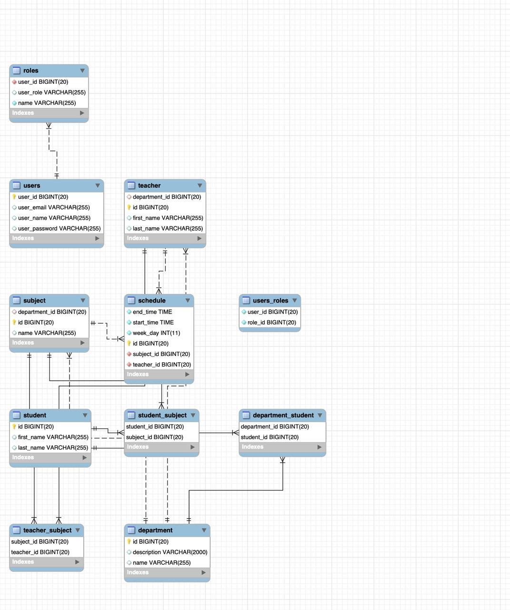

# Faculty

An application for the organisation of the learning process in the Faculty of Information Technology.

# Used Technologies

* Java
* Spring MVC
* Spring Boot
* Maven
* Hibernate
* Spring Data JPA
* Spring Security
* MySQL database
* IntelliJ IDEA
* Thymeleaf
* HTML
* CSS
* Apache Tomcat
* JUnit
* Mockito

# Functionality

* User registration and authentication +
* Database structure +
* Roles +
* Unit tests +
* MVC architecture +

# Database Structure

# Set up DB

Simple option:

* add the information to the application.properties file:
  spring.datasource.url=jdbc:mysql://localhost:3306/YOURSCHEMANAME?useSSL=false&allowPublicKeyRetrieval=true
  spring.datasource.username=YOURUSERNAME
  spring.datasource.password=YOURPASSWORD

Secure option:

* add the database.properties file
* add the database.properties file to the .gitignore
* add the information to the database.properties file:
  spring.datasource.url=jdbc:mysql://localhost:3306/YOURSCHEMANAME?useSSL=false&allowPublicKeyRetrieval=true
  spring.datasource.username=YOURUSERNAME
  spring.datasource.password=YOURPASSWORD

# Start application

* mvn spring-boot:run
* http://localhost:8080

OR

* run FacultyAppApplication.java
